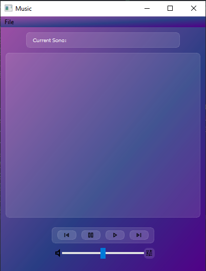
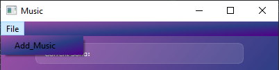
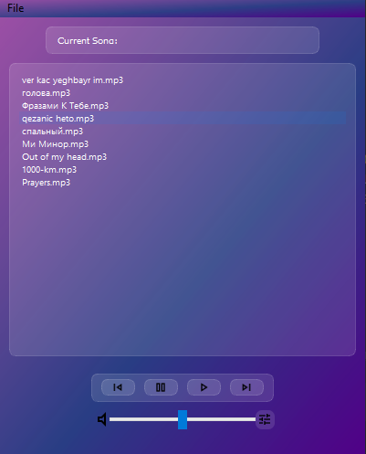
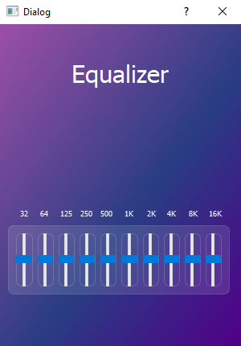

# Music Player

---
[](https://opensource.org/licenses/MIT)
[](https://www.python.org/downloads/release)
[](https://pypi.org/project/PyQt5/)
[](https://pypi.org/project/pygame/)



## Overview

This is my first GUI project, a simple Music Player implemented in Python. It allows users to play, pause, skip tracks, and manage their music library through a graphical user interface (GUI).
It also has a simple equalizer.


## Features

- **Play Controls:** Easily play, pause, and skip tracks.
- **Easy Adding Songs:** From menu you can choose the songs to show them in player.
- **User-Friendly Interface:** Intuitive design for a seamless user experience.

## Adding Songs



## Songs In Player 



## Simple Equalizer



## Technologies Used

- Python: The project is written in Python, making it easy to understand and extend.
- PyQt5: The options of buttons is written using PyQt5
- Qt Designer: It is app not a module. Here I made the graphic part.
- Pygame: I used it for working with files type mp3 ...

## Installation
```bash
pip install PyQt5
pip install pygame
```

